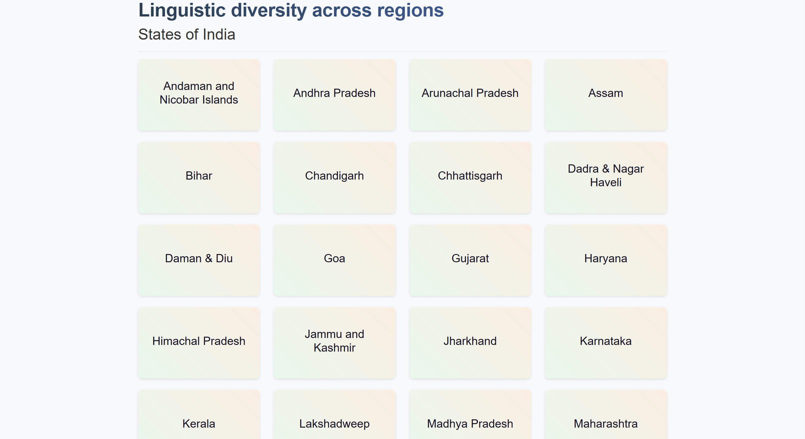
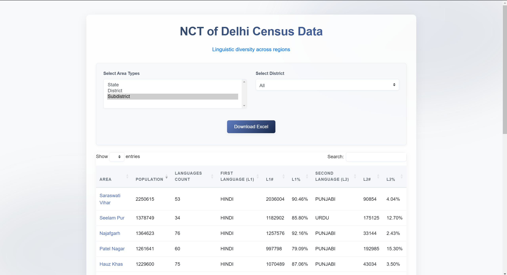
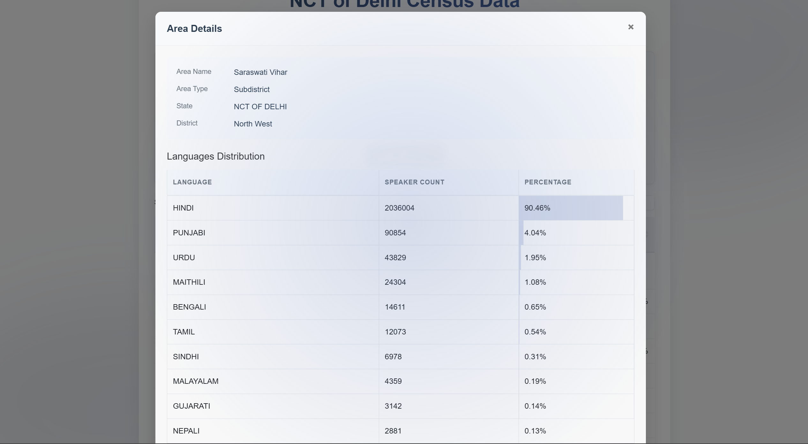

# 📊 Indian Language Stats Web App

This project is a lightweight Node.js/Express web application that displays interactive census data for Indian states. Users can click on a state to view detailed language statistics based on Excel files downloaded from the Census website. It features interactive filtering and sorting.

## Homepage View

## Area Statistics

## Detailed Information

